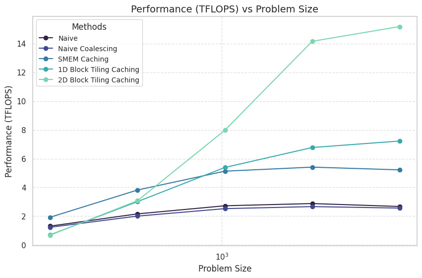
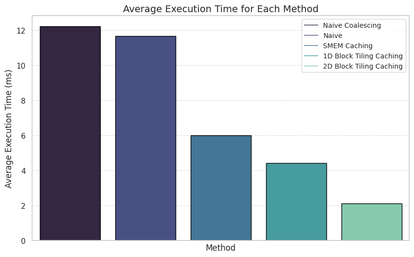

<h1 style="text-align: center;">CUDA-Kernels</h1>

<div style="display: flex; justify-content: center; align-items: center;">
    
    
</div>

## Run Benchmark

To use this repository, follow these steps:
```bash
# Clone the repository:
git clone https://github.com/AhmedZeer/cuda-kernels.git
    
# Navigate into the cloned repository:
cd cuda-kernels
    
# Build it:
make

# Run benchmark for GEMM:
./benchmark_gemm
```
